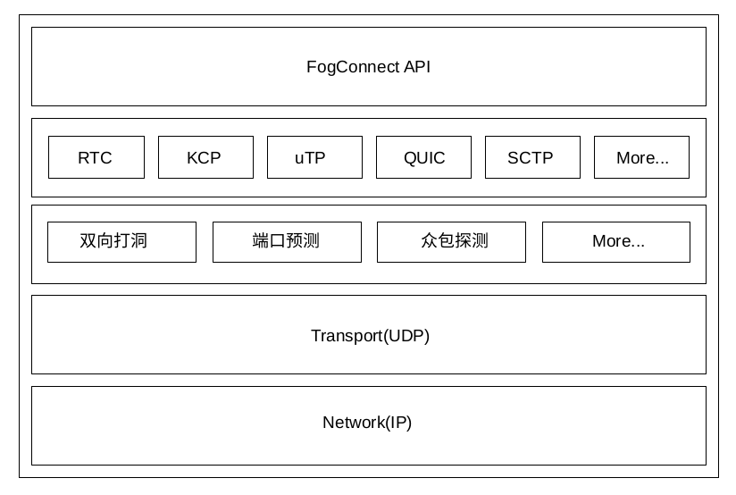

## 雾连接传输组件（FogConnet）

FogConnet 是用于P2P网络中连接、调度、传输等功能于一体的组件

### 架构图


### 特性
- 支持多种传输控制协议（UDP、QUIC、RTC、KCP、uTP、SCTP等）
- 探测NAT类型，并收集和维护用于P2P连接的`<IP:Port>`列表
- 支持双向 “打洞” 和高级端口预测
- NAT类型最优匹配组合策略
- 连接控制与物理距离最近原则
- 所有网络信号采用事件机制处理
- 对资源消耗极少（一般运行状态下内存占用3-5M，峰值不超过50M）
- API简单、易懂，支持多种方式接入

## 快速开始
FogConnect depends on following packages:
- [openssl](https://www.cnblogs.com/emanlee/p/6100019.html)
- [libwebsockets.so.10](https://libwebsockets.org/)
- [libjansson.so.4](https://github.com/akheron/jansson)
- [libevent-2.0.so.5](https://github.com/libevent/libevent)


## Supported Environment
- Linux(e.g. Ubuntu, OpenWrt), Windows, MacOS, Android, iOS

### For example, on Ubuntu/LinuxMint

#### Prepare deps
Install common deps:

``` shell
sudo apt-get install git make
```

Install dependencies:

``` shell
sudo apt-get install openssl libssl-dev libwebsockets-dev libjansson-dev libevent-dev libglib2.0-dev
```

##### Build and run examples
``` shell
make
```

## 性能测试
平均P2P建立连接时间：1.2~2秒

### 系统环境
Ubuntu 16.04.3 LTS \
Intel(R) Core(TM) i5-7500 CPU @ 2.40 GHz \
Mem: 7840 MB
## Examples

### Echo server
```C
#include "fog_connect.h"

char CRLF[2] = "\r\n";

void on_connect(void *arg) {
}

void on_recv(void *arg) {
    fc_info *ud = (fc_info *)arg;
    size_t len = 0;
    char *msg = evbuffer_readln(ud->buff, &len, EVBUFFER_EOL_CRLF);
    if (msg != NULL) {
        fc_send(ud->pr_connect, msg, len);
        fc_send(ud->pr_connect, CRLF, sizeof(CRLF));
        printf("sending: %s\n", msg);
        fc_free(msg);
    }
}

void on_close(void *arg) {
}

int main() {
    fc_setup("**:**:**:**:**:1c");
    fc_set_callback(on_connect, on_recv, on_close);
    getchar();
    fc_exit();
    return 0;
}

```
### Client

```C
#include "fog_connect.h"

void on_connect(void *arg) {
    fc_info *ud = (fc_info *)arg;
    char *msg = strdup("hello\r\n");
    fc_send(ud->pr_connect, msg, strlen(msg));
    printf("sending: %s\n", msg);
    fc_free(msg);
}

void on_recv(void *arg) {
    fc_info *ud = (fc_info *)arg;
    size_t len = 0;
    char *msg = evbuffer_readln(ud->buff, &len, EVBUFFER_EOL_CRLF);
    if (msg != NULL) {
        printf("receiving: %s\n", msg);
        fc_free(msg);
        fc_disconnect(ud->pr_connect);
    }
}

void on_close(void *arg) {
}

int main() {
    fc_setup("**:**:**:**:**:2c");
    fc_connect_peer("**:**:**:**:**:1c", FOG_TRANSPORT_PROTOCOL_KCP, on_connect, on_recv, on_close);
    getchar();
    fc_exit();
    return 0;
}

```

## 开发者简介
- 吴必磊(w@pear.hk)
    - 知名数据恢复软件AnyDataRecovery Pro作者、反汇编与破解专家（同时也是不知名的健身教练）
- 万昌龙(d@pear.hk)
- 陈柳州(66@pear.hk)
