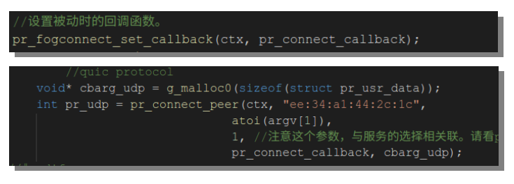
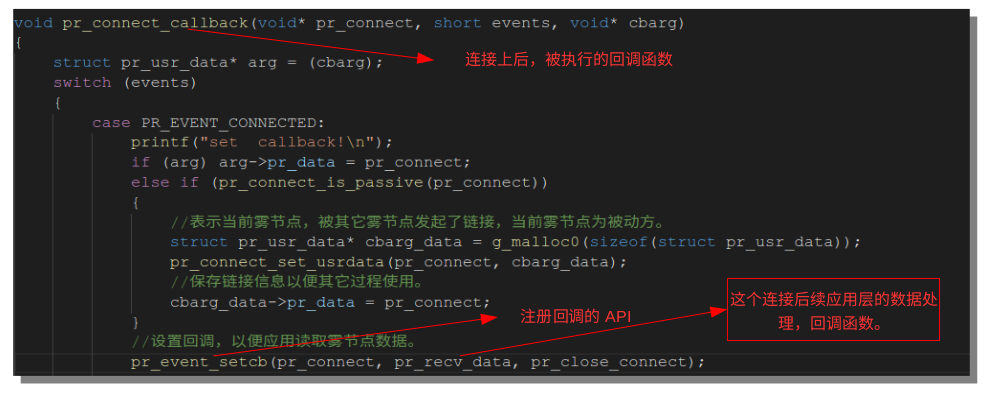
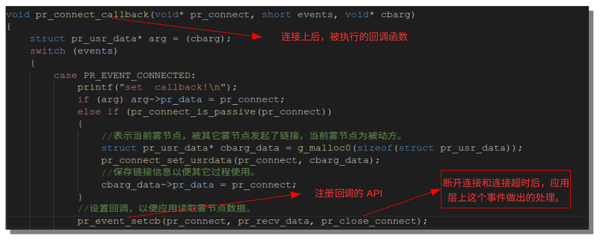
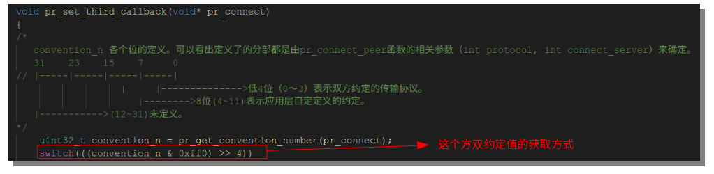
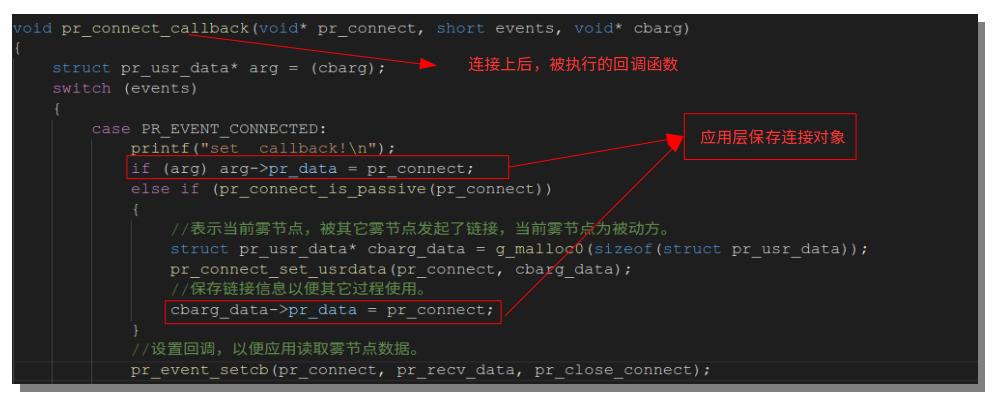

# PTP-Connect

## 以下为 API 使用说明:
- 根据上面的流程图，可以知道接入时就是重写几个回调函数，实际上是3个回调2个操作1个保存,具体回调函数和操作说明如下：

- 第一个回调：节点主动连接或被连接,当连接上时应用层来决定怎么处理这个连接动作(图中回调函数名为pr_connect_callback)。

- 第二个回调：在建立了P2P连接后，在pr_connect_callback被调用时来注册这个连接获得数据后，应用层对数据的处理（图中回调函数名为pr_recv_data）

- 第三个回调：在建立了P2P连接后，在pr_connect_callback被调用时来注册这个连接断开和超时后，应用层对这个事件的处理（图中回调函数名为pr_close_connect）

- 操作一：应用层私有数据与连接对象绑定过程（被动连接的情况下）

- 操作二：主要是双方约定最终这个连接使用应层的那个服务。

- 保存：应用层保存连接对象（void* pr_connect)

## 相关DEMO源码：
- 每个不同平台下的pr_server.c pr_client.c
- intclude目录下的fogconnect.h